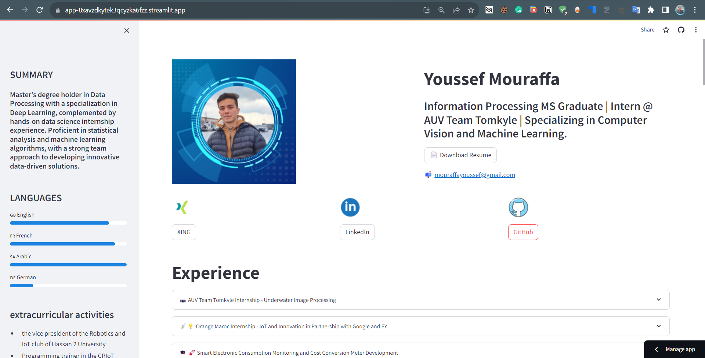

# Youssef's Digital Resume

Hey there! This is Youssef's digital resume created using Streamlit. It's all about me—Youssef Mouraffa! I've built this interactive app to showcase my experiences, education, skills, projects, and certifications.

## Overview

In this Streamlit project, I use Streamlit to create a digital resume for me to describe my skills and experiences. It's an amazing platform that allows me to present a comprehensive view of my professional journey in a user-friendly, interactive way.

## Access the App

I've deployed the digital resume on Streamlit. Here's a screenshot of the deployed app:

Feel free to check it out and explore my profile by clicking [this link](https://digital-resume-with-app-dny3seferew7bf6fmsens7.streamlit.app/).

## Sections

### Experience

This section dives into my professional experiences, covering internships at AUV Team Tomkyle, Orange Maroc, and my involvement in projects in electrical engineering and programming.

### Education

I've detailed my academic journey, sharing insights into my Master's degree in Information Processing and my Bachelor's in Electrical and Electronics Engineering. You'll get a glimpse of the courses, skills, and experiences from each educational milestone.

### Skills

In this part, I've laid out my skill set in various categories, including programming languages, data analysis, machine learning, visualization, and more. It's a showcase of what I'm good at in different domains.

### Projects & Accomplishments

Here, I present my notable projects in traditional machine learning, deep learning, computer vision, NLP, and more. You'll find links to repositories and brief descriptions of each project.

### Certificates

I've gathered a list of certificates that I've earned, mentioning details like issuer, date earned, and links to credentials. It adds credibility to my expertise and achievements.

